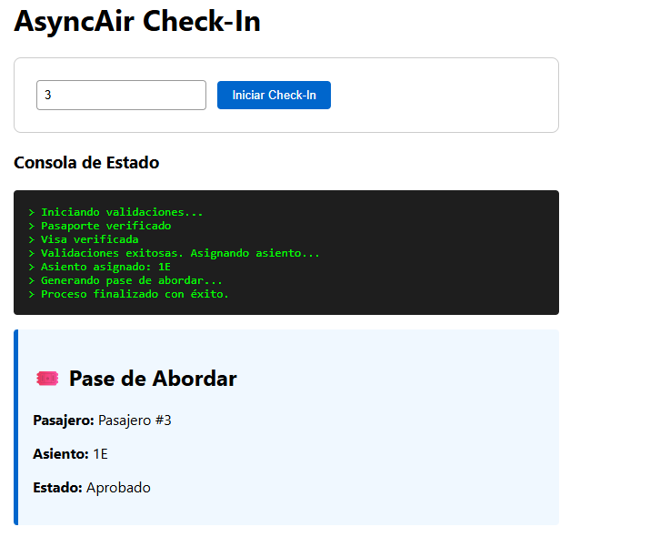
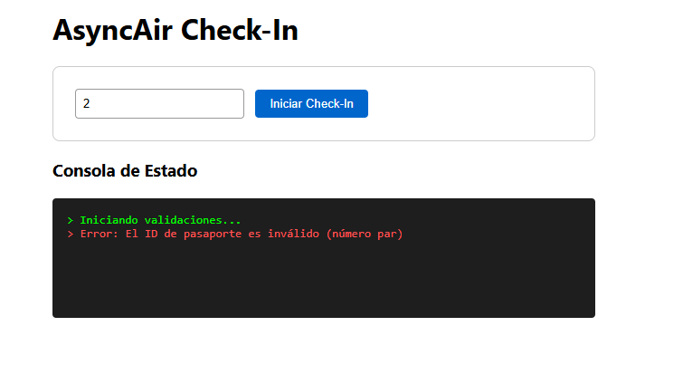

No leas el código línea por línea. En su lugar, explica por qué eligieron este enfoque y cómo cumple las reglas:

1. El Problema de Concurrencia (validarPasaporte y verificarVisa):

Explicación: "Para cumplir con el requerimiento de que ambas validaciones se ejecuten al mismo tiempo, no las encadenamos una tras otra. Usamos Promise.all([validarPasaporte(id), verificarRestriccionesVisa(id)]). Esto dispara ambas al mismo tiempo y espera a que la más lenta termine. Si hiciéramos una después de otra, el check-in tardaría 3.5 segundos en esa fase; con Promise.all tarda solo 2 segundos (el tiempo de la visa)".

Muestra : "Aquí vemos que ambas se inician, y el proceso solo sigue después de que ambas se verifican".

2. Programación Funcional e Inmutabilidad:

Explicación: "Toda la lógica de negocio en app.js cumple estrictamente con el paradigma funcional. No verán ninguna variable let o global. Todo el flujo de datos ocurre dentro de los bloques .then(). No modificamos objetos existentes; la función generarPaseAbordar crea un objeto nuevo e inmutable con toda la información, en lugar de mutar un objeto 'pasajero' vacío".

3. Composición y Pureza (Nuestra Arquitectura):

Explicación: "Dividimos la solución en dos partes: un Núcleo Funcional que solo maneja lógica y promesas puras, y una Capa Imperativa para el DOM. Por ejemplo, la función principal iniciarCheckInLogica es pura. No interactúa con la pantalla negra de la consola; en su lugar, recibe una función logger inyectada. Esto la hace testeable y reutilizable".

4. Manejo de Errores Fail-Fast:

Explicación: "Implementamos un manejo de errores centralizado. Cualquier fallo en la cadena de promesas (un ID par, una visa inválida, o el timeout) salta instantáneamente a un único bloque .catch() al final, garantizando que el usuario siempre vea lo que pasó y no se ejecuten pasos innecesarios".

Muestra : "Aquí vemos cómo el .catch() final atrapó el rechazo por ID par y lo mostró en la consola negra con estilo rojo".

5. El Bonus (Timeout Global):

Explicación: "Usamos composición de funciones para el timeout. Creamos una función de orden superior, conTimeout, que toma la promesa principal del check-in y la hace competir contra una promesa de 4 segundos usando Promise.race(). La primera que termina gana. Si el check-in tarda más de 4s, la promesa de timeout 'gana' y rechaza todo el proceso".